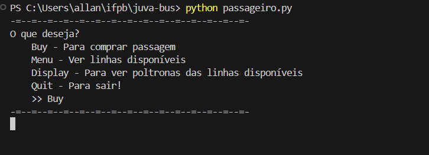

# API Juva Bus
API que trabalha com conexão cliente-servidor, que funciona como emissor de notas fiscais para uma empresa de ônibus. Tem como principal característica a venda de passagens para múltiplos clientes simultaneamente

